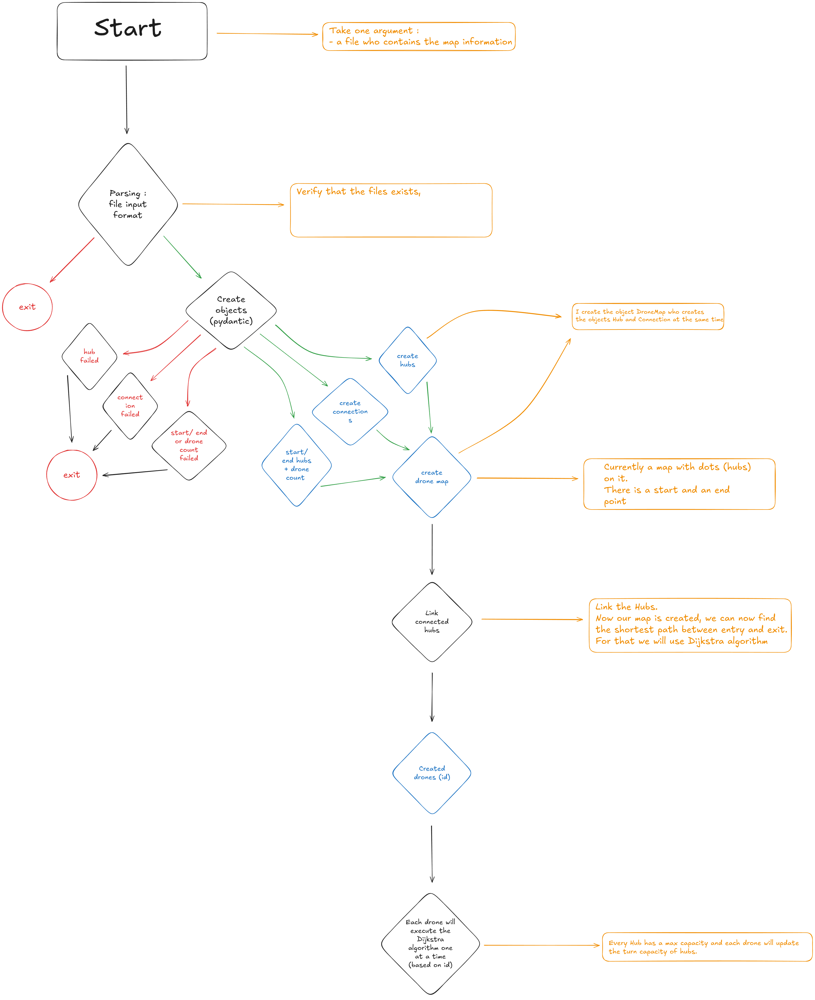

*This project has been created as part of the 42 curriculum by [adamez-f](https://github.com/Nop-o).*

# Fly-in

## Table of Contents
- [Fly-in](#fly-in)
	- [Table of Contents](#table-of-contents)
	- [Description](#description)
	- [Instructions](#instructions)
		- [All available commands](#all-available-commands)
		- [Running a specific map](#running-a-specific-map)
	- [Algorithm](#algorithm)
	- [Visual Representation](#visual-representation)
		- [Controls](#controls)
		- [Features](#features)
	- [Parsing](#parsing)
	- [Map components](#map-components)
		- [Hub](#hub)
		- [Connection](#connection)
		- [Zone type](#zone-type)
		- [Colors](#colors)
	- [Maps](#maps)
		- [Easy](#easy)
		- [Medium](#medium)
		- [Hard](#hard)
		- [Challenger](#challenger)
	- [Initial project structure](#initial-project-structure)
	- [Resources](#resources)
		- [AI usage](#ai-usage)

---

## Description

The goal of this project is to design a system that efficiently routes a fleet of drones from a central
base (start) to a target location (end), while navigating a dynamic network (graph) under
a set of strict constraints and optimization goals.

The graph is represented as a network of connected zones, where connections define possible movement paths between zones. Each zone has a type that affects how drones can move through it, and each hub and connection has a maximum drone capacity that must be respected at all times.

Once all paths are computed, a pygame-based visual simulation lets you step through the solution turn by turn and inspect the state of the map interactively.

---

## Instructions

To get started, use the provided `Makefile`:

```bash
make install   # create virtual environment and install dependencies
make run       # run with the default map
```

### All available commands

| Command | Description |
| :--- | :--- |
| `make install` | Create virtual environment and install dependencies |
| `make clean` | Remove all temporary files and caches |
| `make run` | Execute the main script |
| `make lint` | Run flake8 and mypy with standard checks |
| `make lint-strict` | Run flake8 and mypy with strict mode |
| `make debug` | Run the main script in debug mode (pdb) |
| `make help` | Show a help message |

### Running a specific map

You can pass a custom map path at runtime:

```bash
make run MAP=maps/easy/01_linear_path.txt
```

The default map is `maps/challenger/01_the_impossible_dream.txt`.

---

## Algorithm

Drone routing is solved using a modified **Dijkstra algorithm**. Each drone computes its shortest path independently, then updates the capacity of every hub and connection it passes through, turn by turn. Subsequent drones must account for those reservations when planning their own route.

Key implementation choices:

- **Weight per hub**: each hub has a cost based on its zone type (1 turn for NORMAL/PRIORITY, 2 for RESTRICTED, infinity for BLOCKED).
- **Capacity checking**: before moving to a hub or through a connection, the algorithm verifies that the target is not at capacity at the arrival turn.
- **Wait time (`stop_time`)**: if a hub or connection is full at the planned arrival turn, the drone waits at its current position until it becomes accessible. This extra cost is added to the path distance.
- **Tie-breaking**: when two paths have the same cost, the one passing through more PRIORITY hubs is preferred (tracked via a priority counter).
- **RESTRICTED hubs**: take 2 turns to enter — the drone occupies the connecting connection for 1 turn, then the hub for 1 turn. Both turns are reserved in the capacity tracking.
- **Capacity updates**: after a path is finalized, `_update_hub_connection_capacity` marks every hub and connection the drone visits, so later drones see an accurate picture of what is available.

---

## Visual Representation

After all paths are computed, a pygame window opens and lets you explore the solution interactively.

### Controls

| Key | Action |
| :--- | :--- |
| `←` / `→` | Step back / forward one turn |
| `R` | Restart from turn 0 |
| `F` | Toggle fullscreen |
| `ESC` | Quit |

### Features

- **Hubs** are drawn as circles. The fill color is configurable per hub; the border color reflects the zone type (see legend in the bottom-right corner).
- **Connections** are drawn as lines between hubs. Hovering a connection highlights it and shows a tooltip with its capacity and current drone count.
- **Drones** are drawn as colored circles on top of hubs or connections. Each drone has a unique color from a fixed palette.
- **Drone count**: the number of drones currently at a hub is displayed at the center of that hub. During a RESTRICTED connection stop, the count is displayed at the midpoint of the connection.
- **Exit hub**: marked with a ★ so it is immediately identifiable.
- **Tooltips**: hovering a hub or connection shows its name, coordinates, max capacity, and current drone count.
- **Legend**: a small box in the bottom-right corner shows the border color for each zone type.
- **Resizable window**: the map rescales automatically when the window is resized.

---

## Parsing

Given a map file, the parser reads and validates the data using Pydantic models, then constructs a `DroneMap` object containing all hubs, connections, and drone configuration. Invalid files are rejected with a descriptive error message.

---

## Map components

A drone map contains:
- a number of drones
- a starting hub
- an ending hub
- intermediate hubs
- connections between hubs

### Hub

Each hub has:
- a **name**
- **coordinates** `(x, y)`
- a **zone type** (see below)
- a **color** (optional, defaults to zone type color)
- a **max drone capacity**
- a list of **neighbors**: connected hubs and the connection linking them
- a **turn capacity**: tracks how many drones are on the hub at each turn

### Connection

Hubs are linked by connections. Each connection has:
- `zone_1` and `zone_2`: the names of the two hubs it links
- a **max drone capacity**
- a **turn capacity**: tracks how many drones are on the connection at each turn

### Zone type

| Zone | Travel cost | Notes |
| :--- | :--- | :--- |
| `NORMAL` | 1 turn | Standard hub |
| `PRIORITY` | 1 turn | Preferred over NORMAL when paths are equal |
| `BLOCKED` | ∞ | Impassable |
| `RESTRICTED` | 2 turns | Drone stops on the connection for 1 turn, then on the hub for 1 turn |

### Colors

Hubs have an RGB color `(R, G, B)` where each component is between 0 and 255. If no color is specified, the zone type determines the default:

| Zone | Default color |
| :--- | :--- |
| NORMAL | Green |
| PRIORITY | Light blue |
| RESTRICTED | Yellow |
| BLOCKED | Red |

---

## Maps

A default map path can be overridden with `make run MAP=<path>`. Available maps:

### Easy
- `maps/easy/01_linear_path.txt`
- `maps/easy/02_simple_fork.txt`
- `maps/easy/03_basic_capacity.txt`

### Medium
- `maps/medium/01_dead_end_trap.txt`
- `maps/medium/02_circular_loop.txt`
- `maps/medium/03_priority_puzzle.txt`

### Hard
- `maps/hard/01_maze_nightmare.txt`
- `maps/hard/02_capacity_hell.txt`
- `maps/hard/03_ultimate_challenge.txt`

### Challenger
- `maps/challenger/01_the_impossible_dream.txt`

---

## Initial project structure



---

## Resources

[Codecademy — Dijkstra's Shortest Path Algorithm](https://www.codecademy.com/article/dijkstras-shortest-path-algorithm)  
[Excalidraw — Visual diagramming tool used for planning](https://excalidraw.com/)  
[Pydantic documentation](https://docs.pydantic.dev/)  
[pygame documentation](https://www.pygame.org/docs/)  

### AI usage

AI was used throughout this project for:
- **Code review**: spotting unused variables, dead code, and inconsistent type annotations.
- **README**: correcting spelling mistakes and structuring this document.